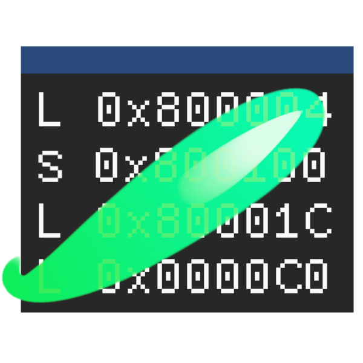
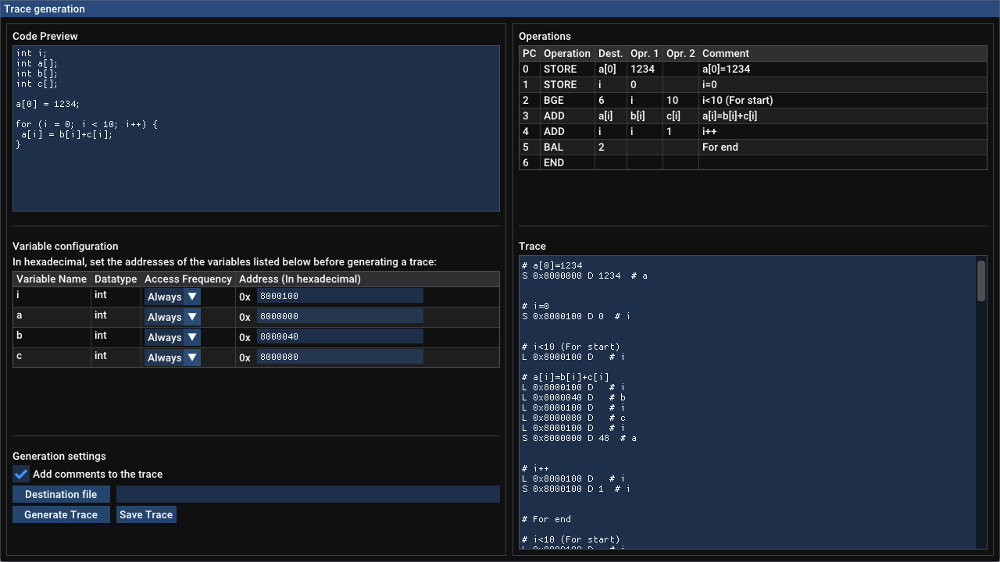

<div align="center">
  
</div>
<h1 align="center">NuTracer</h1>
<h2 align="center">A simple C-like interpreter and trace generator for NuCachis.</h2>
<h3 align="center">Arquitectura y Tecnología de Computadores, Universidad de Cantabria (<a>https://www.atc.unican.es</a>)</h3>
<div align="center">
  
</div>


## About the project
NuTracer is a simple C-like interpreter and trace generator for the NuCachis cache simulator. It allows for straightforward trace generation from C-style pseudocode and is suitable both for teachers and alumni. Its main features are:
- Automatic code parsing, translation to pseudo-assembly and interpretation.
- Automatic variable detection, configurable addresses and frequency of appearance on the trace.
- Comment generation for easier trace reading.
- Detection of loops, incorrect syntax and out of bounds accesses.
- Interactive GUI or, alternatively, CLI mode.

## Getting started
### Prerequisites
The GUI requires OpenGL and SDL2. For Debian based systems, install the following dependencies:
```
apt-get install cmake gcc git libsdl2-dev libgl1-mesa-dev libglu1-mesa-dev
```

### Installation
1. Clone the repository:
```
git clone https://github.com/aiechevarria/nutracer.git
```

2. Run cmake:
```
cd nutracer
mkdir build
cd build
cmake ..
cmake --build .
```

3. Execute with:
```
./nutracer
```

## Usage
 By default NuTracer will run in GUI mode and prompt the user for all required fields. On CLI mode, it is required to set all variable addresses manually
th the `-v` flag.

Output of `./nutracer -h`:
```
./nutracer [OPTIONS]


OPTIONS:
  -h,     --help              Print this help message and exit 
  -i,     --input TEXT:FILE   Path to the input pseudocode file 
  -c,     --config TEXT:FILE  Path to the NuCachis configuration file 
  -o,     --output TEXT       Path to the output file 
  -v,     --variable TEXT ... Define a variable's base address (NAME=0x80) 
  -f,     --frequency TEXT ... 
                              Define a variable's access frequency (always, once, never) 
                              (NAME=always) 
  -g,     --nogui             Disable the GUI 
  -m,     --comments          Add comments to the trace 
  -d,     --debug             Toggles debug information 

```

To create a trace, a pseudocode file and a NuCachis configuration file with the `page_base_address`, `page_size` and `word_width` directives are required. 
Pseudocode files support the following:
- Primitive C datatypes.
- For loops and nested for loops.
- Basic arithmetic operations (+, -, * and /), assignments (=) and compound assignments (+=, -=, ++, --).
- Array indexing with variables and constants.

And have the following limitations and requirements:
- While loop and if statement support is not present, though it could be easily added.
- All operations must be terminated by a semicolon.
- Multiple operations cannot take place in a single line (e.g. i = j - k + l is forbidden).

Sample pseudocode files are present in the `samples` directory.